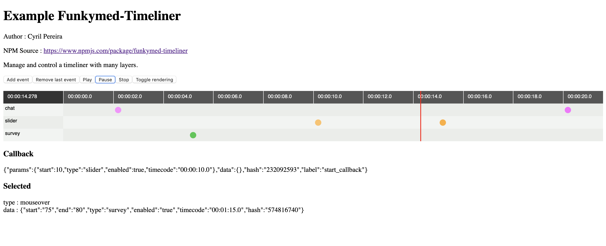

# Timeliner

Author : Cyril Pereira

Timeliner is a component to manage a timeline.
In the example you can found a live interraction and a control of the timecode in the timeline.
You also can use callback to fire some event from blocks in the timeline.
You can use the engine without display the timeline.

## Features
- Display a timeline from a json object
- Colors the groups of blocks
- Toggle rendering timeline
- EventListner and callback on blocks
- Callback when the block is fired



## Install

```bash
yarn add funkymed-timiliner --save
```

or 

```bash
npm install funkymed-timiliner 
```

## Demo

The component in action : http://medcg.free.fr/tmp/npm-timeliner

### build the demo locally

```bash
yarn build
yarn start
```
